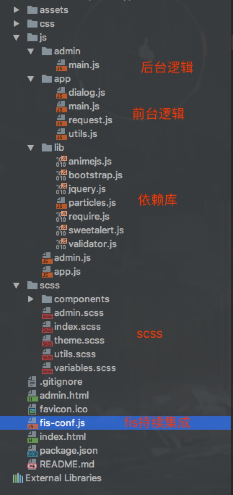
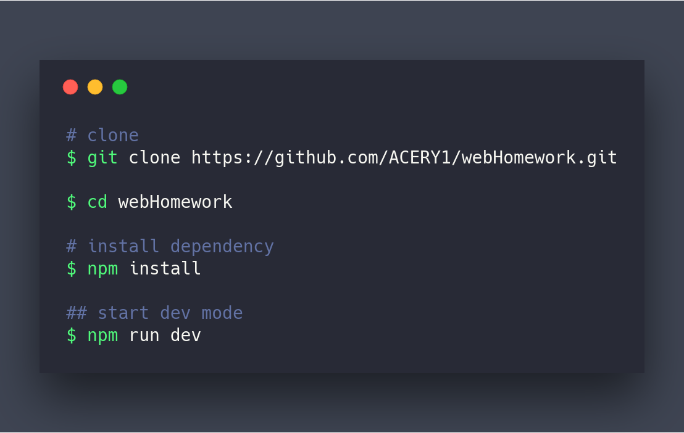
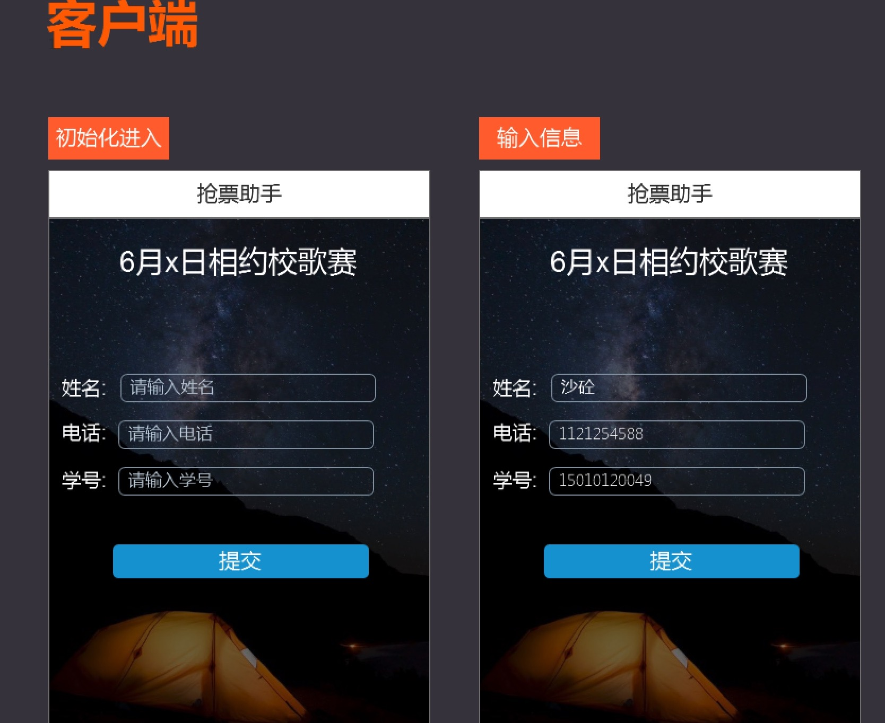

# Standard RobbingTicket System :: Mars

> 基本抢票系统与后台管理系统

demo: [http://p3.helloyzy.cn](http://p3.helloyzy.cn)

Mars抢票系统可用于各类活动的的票务发放，并在高并发上做了一定的优化，保证在80%的普通业务场景下保持可用性。

## 目录

- [背景](#%e8%83%8c%e6%99%af)
- [前端环境搭建](#%e5%89%8d%e7%ab%af%e7%8e%af%e5%a2%83%e6%90%ad%e5%bb%ba)
- [数据库设计](#%e6%95%b0%e6%8d%ae%e5%ba%93%e8%ae%be%e8%ae%a1)
- [接口设计](#%e6%8e%a5%e5%8f%a3%e8%ae%be%e8%ae%a1)
- [前端效果展示](#%e5%89%8d%e7%ab%af%e6%95%88%e6%9e%9c%e5%b1%95%e7%a4%ba)
- [Collaborators](#Collaborators)
- [License](#license)

## 背景

在各类活动场景下，总是会出现票少人多的情况，所以就会有`抢票`的需求存在，为了更好的分析数据，量化分析发放票数和人数之间的关系等，搭建了抢票系统和其后台MIS系统。通过在后台`定制活动`，前台`定制化生成抢票页面`并在后台记录抢票人的数据以及发送抢票结果短信来实现整个用户的抢票流程。并通过Redis来缓解数据库的I/O压力，从而减少响应时间。部分设计架构参考[QQ红包技术方案全解密](http://www.infoq.com/cn/articles/qq-red-envelopes-technology-program)

**系统优点**

1. 前端采用Flexible尺寸适配方案，兼容大量移动端和PC端。
2. 使用浏览器的LocalStorage用于减轻服务器的存储压力。
3. 增加一层Redis存储形成一个抢票缓存池，用于减轻数据库的I/O压力，从而减少响应时间。
4. 通过ip+手机号的双重验证防止刷票。
5. 后台清晰的数据管理以及Excel导出。

**技术栈**

前端：

基于`require.js`的前端组件化方案，并通过`scss`进行页面实现。使用`fis3`作为前端工程化的持续集成方案。

前端项目目录结构为：

后端：

## 前端环境搭建

## 数据库设计

## 接口设计

## 前端效果展示

具体请看[demo](http://p3.helloyzy.cn)

## Collaborators

## license

[MIT LICENSE](./LICENSE.md)

